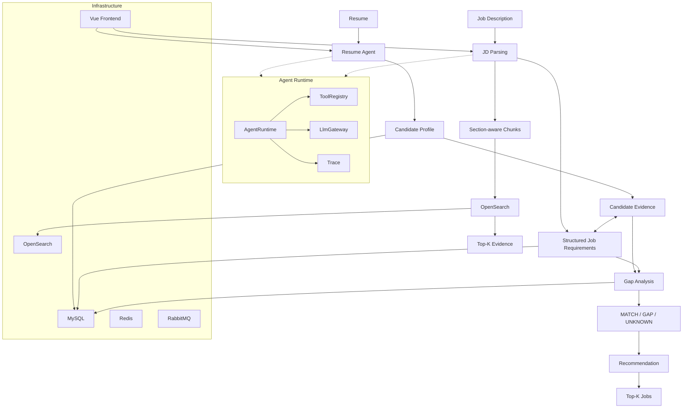

# DO NOT MISS V2 — Interest-Driven Growth & Career Matching

**An AI Agent system that connects personal interests, personal growth, abilities, and career opportunities.**

**DO NOT MISS V2 —— 兴趣导向的个人成长与职业匹配 Agent 系统**，从兴趣和个人成长出发，沉淀个人能力画像，并结合 Resume、JD、Evidence、Retrieval、Gap Analysis 和 Recommendation，形成从个人成长到职业匹配的 Agent 闭环。

```text
Interest → Growth → Ability → Career → Job Matching
```

## 核心闭环

### ① 我对什么感兴趣？我成长成了什么样？

```text
Interest
   ↓
Activities / Projects / Courses / Research / Skills
   ↓
Growth Agent
   ↓
Personal Growth Information
   ↓
Ability & Growth Profile
```

系统从用户的兴趣和长期成长经历出发，沉淀个人成长信息与能力画像。

### ② 我有什么能力？

```text
Resume → Resume Agent → Candidate Profile → Candidate Evidence
```

将简历转换为结构化候选人画像和可追溯的 Candidate Evidence。

### ③ 什么岗位适合我？

```text
JD → Structured Requirements → Job Evidence / OpenSearch Retrieval
                              ↓
Candidate Evidence ↔ Job Requirements
                              ↓
                    MATCH / GAP / UNKNOWN
                              ↓
                       Recommendation
                              ↓
                         Top-K Jobs
```

最终将个人成长与岗位需求连接起来，回答：

> **我对什么感兴趣 → 我具备什么能力 → 我适合什么职业 → 哪些岗位更适合我。**

## 整体架构



## Growth Stage

Activity、Project、Course、Research 和 Skills 经由 Growth Agent 沉淀为 Personal Growth Information，是 Career Intelligence 的上游个人成长基础。

```text
Activities / Projects / Courses / Research / Skills → Growth Agent → Personal Growth Information
```

## Agent Runtime

- **AgentRuntime**：统一驱动 Agent Run、Step、Action、Tool Invocation 和状态转移。
- **ToolRegistry**：注册并调用 Agent tools。
- **LlmGateway**：隔离具体模型 Provider，提供统一 LLM 调用入口。
- **Trace**：记录运行状态、耗时和 token usage，并保护原始 Prompt、Response、Resume 与 JD 内容。

## Resume Intelligence

```text
Resume → Immutable Resume Version → Resume Agent → Structured Resume → Candidate Profile Snapshot → Candidate Evidence
```

Resume 版本和 content hash 保证历史输入可追溯；Candidate Evidence 保存 claim、skill code、confidence 及来源引用。

## Job Description Intelligence

```text
JD → Immutable Job Requirement Version → Section-aware Chunks + Structured Requirements → OpenSearch Index
```

JD 同时产出结构化岗位要求和可检索 chunks，便于后续证据检索与匹配。

## OpenSearch Retrieval

Job evidence 使用独立索引 `do_not_miss_job_requirements`。当前生产演示以 BM25 为主，同时预留可选 Vector Retrieval + RRF 扩展。

```text
JD → OpenSearch Index → BM25 Retrieval → Top-K Evidence
```

已完成一次真实 BM25 E2E 验证：JD version 8 成功建立索引，查询返回 Top-K 结果（REQUIREMENTS、GENERAL、RESPONSIBILITIES）。

## Gap Analysis

Gap Analysis 将 Candidate Evidence 与 Structured Requirements 进行 evidence-grounded matching，并保留证据不足时的 UNKNOWN：

- **MATCH**：已有证据充分支持岗位要求。
- **GAP**：要求与候选人能力之间存在明显缺口。
- **UNKNOWN**：证据不足，无法可靠判断。

每条结果都保留 evidence 与 source reference，便于解释和追溯。

## Recommendation

Recommendation 复用 Gap Analysis 结果进行 deterministic ranking，输出 Top-K 岗位及可解释结果。排序综合 weighted match、critical gaps 和 unknowns，用户可以看到推荐理由、主要优势和主要缺口。

## Demo Walkthrough

1. 创建 Resume。
2. 执行 Resume Parse，查看 Candidate Profile 与 Candidate Evidence。
3. 创建 JD。
4. 执行 JD Parse，生成 Structured Requirements 与 chunks。
5. 在 Retrieval Test 中检索岗位证据。
6. 运行 Gap Analysis，查看 MATCH、GAP、UNKNOWN 及证据追溯。
7. 选择多个已解析 JD，查看 Top-K Recommendation。

## Technology Stack

- Java 21 / Spring Boot
- Vue 3 / TypeScript
- MySQL / Redis / RabbitMQ
- OpenSearch / BM25
- Qwen / OpenAI-compatible LLM
- AgentRuntime / ToolRegistry / LlmGateway
- Docker Compose

## Evaluation

- **Gap Analysis**：12-case fixture 与 policy evaluation。
- **Job Retrieval**：20-case evaluation fixture，支持 Recall@K、MRR、nDCG 计算。
- **Recommendation**：evaluation fixture 与 Hit Rate@K、Precision@K、Recall@K、MRR evaluator。
- **BM25 Retrieval**：已完成真实 E2E 验证。

README 不虚构 Recall、MRR、nDCG 或 Hit Rate 数字；上述指标在独立 fixture/evaluator 中计算。

## Current Limitations

1. Candidate Evidence extraction 仍较粗，可能产生重复或过宽证据。
2. 当前 Retrieval Demo 以 BM25 为主，Vector/RRF 为可选扩展。
3. Recommendation 当前采用 deterministic policy，尚未引入 learned ranking。

## Future Extensions

- 更细粒度的 Candidate Evidence extraction。
- Vector Retrieval + RRF / learned reranking。
- Growth Profile 与 Career Profile 的统一语义层。

## Local Development

### Docker Compose

```powershell
docker compose up -d --build
```

默认地址：Frontend `http://localhost`、Backend `http://localhost:8080`，以及 Compose 中配置的 MySQL、Redis、RabbitMQ、OpenSearch 服务。

### Backend / Frontend

```powershell
cd backend
mvn spring-boot:run

cd ..\frontend
npm install
npm run dev
```

### LLM Configuration

凭据只能通过环境变量注入，不要写入源码或提交到仓库：

```text
AI_PROVIDER=qwen
AI_MODEL=qwen3.7-flash
AI_BASE_URL=<your-endpoint>
DASHSCOPE_API_KEY=<your-api-key>
AI_TIMEOUT_SECONDS=60
```

项目同时保留 OpenAI-compatible provider 支持；配置 DashScope Native `/api/v1` 时使用对应 Native client。

### Job Search

```text
JOB_SEARCH_ENABLED=true
JOB_SEARCH_VECTOR_ENABLED=false
```

当前演示优先验证 BM25；只有显式启用且 embedding client 可用时才参与 Vector/RRF。

## GitHub Upload Checklist

- 不提交 `.env` 或真实 API Key。
- 不提交 `backend/target/`、`frontend/node_modules/`、`frontend/dist/` 或本地日志。
